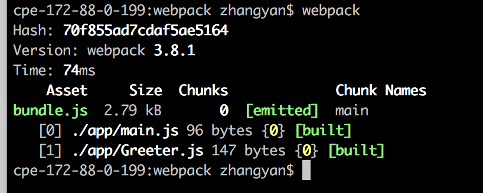
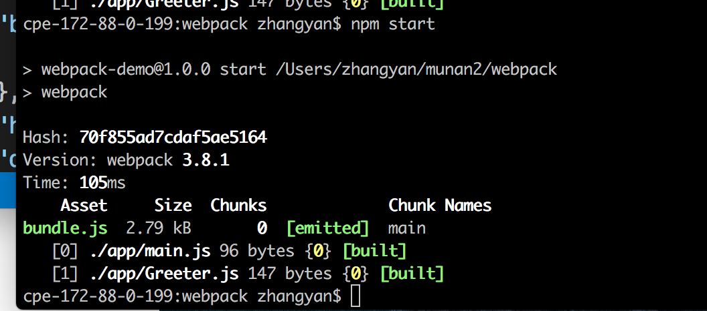
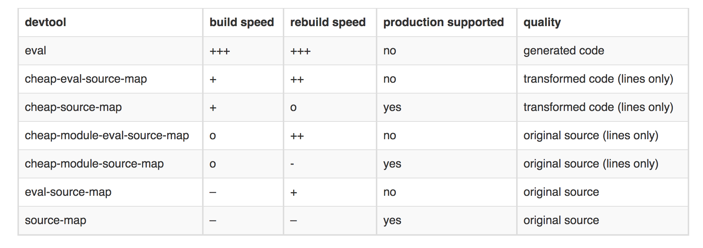

# webpack
### webpack的使用
#### webpack特征
- 插件化 提供了丰富的插件接口，webpack开发了很多插件作为内置功能
- 速度快 使用异步IO以及多级缓存机制
- 丰富的loaders loaders用来对文件做预处理，这样webpack就可以打包任何静态文件
- 高适配性 webpack支持AMD/CommonJS/ES6模块方案，webpack会静态解析代码，自动帮你管理文件之间的依赖，其对第三方库的兼容性很好
- 代码拆分 将代码分片，按需打包，这种机制很好保证页面只加载需要的JS代码，减少首次请求时间
- webpack提供了优化机制来减少打包输出的文件大小，提供hash机制，解决浏览器缓存问题
- 开发模式友好： webpack为开发模式提供了很多辅助功能，比如SourceMap、热更新等

#### 安装
>```
	npm install -g webpack//全局安装
	npm install --save-dev webpack //安装到项目目录
>```

1. 在文件夹里创建package.json文件，在终端上使用npm init命令自动创建这个package.json文件

	```
	npm init
	```
2. package.json文件就绪后，在本项目中安装webpack作为依赖包
	
	```
	npm install --save-dev webpack
	```
3. 前面两歩安装完成可以看到文件夹的目录结构为一个node_modules文件夹里面存放依赖，一个package.json文件(npm说明文件)。现在在文件里创建两个文件夹,app文件夹和public文件夹。
	
	```
	app文件用来存放原始数据和我们将写的JavaScript模块
	public文件存放浏览器读取的文件(包括使用webpack打包生成的js文件以及一个index.html文件)
	```
	- public文件夹内的index.html文件中写入最基础的代码，它在这里目的在于引入打包后的js.
	- app文件夹存放Greet.js和main.js文件
	
	>
	假设在index.html文件里写入最基础的代码,bundle.js是打包之后的js文件
	
	```
	<!DOCTYPE html>
	<html lang="en">
	<head>
	    <meta charset="UTF-8">
	    <meta name="viewport" content="width=device-width, initial-scale=1.0">
	    <meta http-equiv="X-UA-Compatible" content="ie=edge">
	    <title>webpack project</title>
	</head>
	<body>
	    <div id="root"></div>
	    <script src="bundle.js"></script>
	</body>
	</html>
	```
	在Greet.js中定义一个函数，并根据CommonJS将其导出
	
	```
	module.exports = function () {
	    var greet = document.createElement('div');
	    greet.textContent = "hi there and greetings";
	    return greet;
	}
	```
	在main.js引入Greet.js，将Greet返回的节点插入页面
	
	```
	const greeter = require('./Greeter.js');
 	document.querySelector('#root').appendChild(greeter());
	```
	
#### 使用webpack的方式
1. 在终端中敲入命令行

	```dash
	{extry file}出填写入口文件的路径，本文中就是上述main.js的路径，
   {destination for bundled file}处填写打包文件的存放路径
    填写路径的时候不用添加{}
   webpack {entry file} {destination for bundled file}
	```
	
	```
	webpack zhangyan$ webpack app/main.js public/bundle.js//全局已经装了webpack
	或者
	node_modules/.bin/webpack app/main.js public/bundle.js//全局没有装webpack，只有用node_modules里的
	```
2. 通过配置文件来使用
	在根目录下定义一个配置文件webpack.config.js，在其中写上一些简单配置，主要涉及入口文件路径和打包后文件的存放路径
	
	```
	module.exports = {
	    entry: __dirname + '/app/main.js', //唯一入口文件
	    output: {
	        path: __dirname + '/public', //打包后文件存放的地方
	        filename: 'bundle.js' //打包后输出文件的文件名
	    }
	}
	```
	>__dirname是nodejs中的一个全局变量，指向当前执行脚本所在的目录
	
	有了这个配置后，在终端里运行webpack(非全局安装需要使用node_moudules/.bin/webpack)命令，这条命令会自动引用webpack.config.js文件中的配置选项
	
3. 更快捷的执行打包任务
	对npm进行配置后可以在命令行中使用简单的npm start来替换上面繁琐的node_module/.bin/webpack这样的命令，在package.json中对scripts对象进行配置  
	
	```
	"scripts": {
	   "start": "webpack"
	 },
	```
	在命令行里输入npm start 
	
### webpack的强大功能
#### 生成Source Maps(个人称之为资源映射表)
 

devtool选项 | 配置结果
------------|------
eval       | 每个module会封装到eval里包裹起来执行，并且会在末尾追加注释 //@ sourceURL
source-map | 生成一个SourceMap文件，在一个单独文件中产生一个完整且功能完全的文件，这个文件具有最好的source map,但是它会减慢打包速度 
hidden-source-map| 和source-map一样，但是不会再dubble末尾追加注释
inline-source-map| 生成一个DataUrl形成的SourceMap文件
eval-source-map | 每个module会通过eval()来执行，并且生成一个DataUrl形式的SourceMap。使用eval打包源文件模块，在同一文件中生成干净的完整的SourceMap。这个选项可以在不影响构建速度的前提下生成完整的SourceMap，但是对打包后输出的js文件的执行具有性能和安全的隐患， 在开发阶段这是一个很好的选择，但是在生产阶段一定不要启用这个选项
cheap-source-map| 生成一个没有列信息的SourceMaps文件，不包含loader的SourceMap。你如babel的SourceMap
cheap-module-source-map| 生成一个没有列信息的SourceMaps文件，同时loader的SourceMap也被简化为只包含对应行的。在一个单独的文件中生成一个不带列映射的map,不带列映射可以提高打包的速度，但是也是的浏览器开发者工具只能对应到具体的行，不能对应到具体的列，会对调试造成不便。

